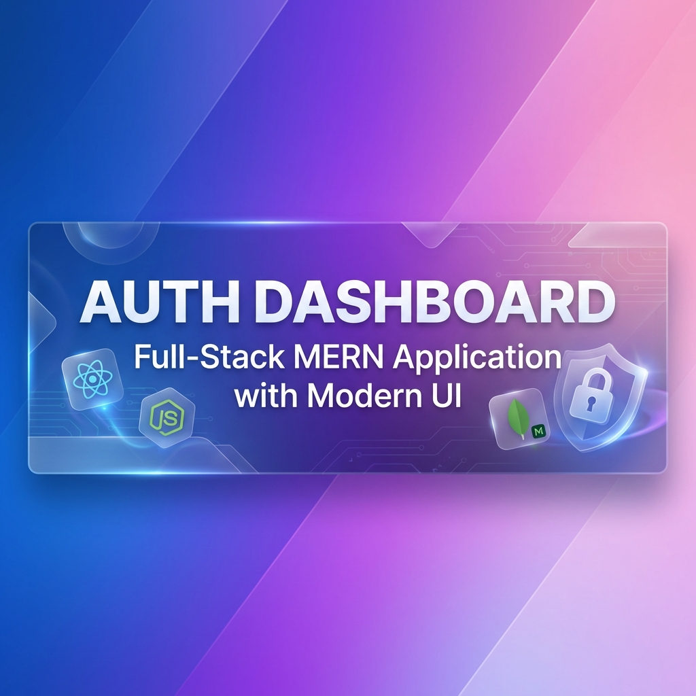
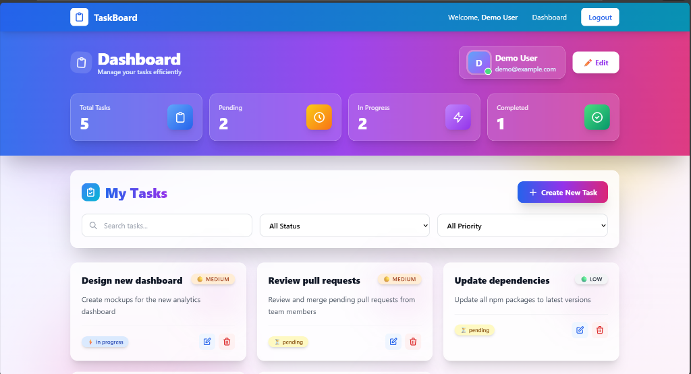
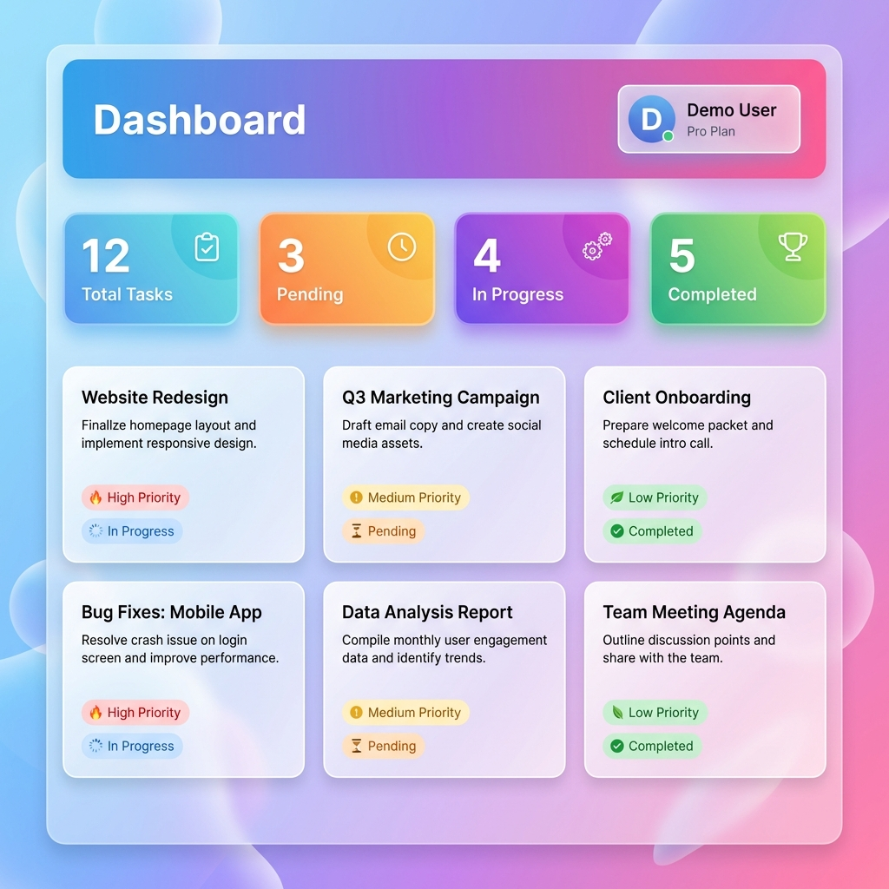
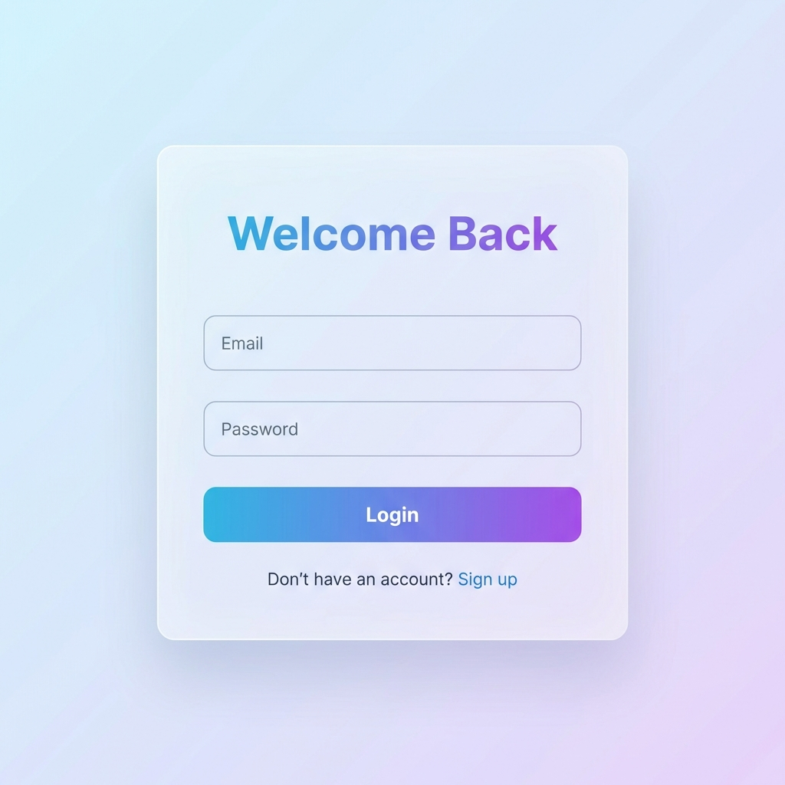

# Auth Dashboard Application



<div align="center">

[](https://reactjs.org/)
[](https://nodejs.org/)
[](https://www.mongodb.com/)
[](https://tailwindcss.com/)
[](https://expressjs.com/)
[](https://jwt.io/)

A modern full-stack web application featuring **authentication**, **user profiles**, and **task management** with a beautiful glassmorphic UI built using React, TailwindCSS, Node.js, Express, and MongoDB.

[Features](#-features) • [Demo](#-screenshots) • [Quick Start](#️-setup-instructions) • [API Docs](#-api-documentation)

</div>

---

## 📸 Screenshots

### Dashboard - Modern Glassmorphic Design


### Task Management Interface


### Authentication


---

## 🚀 Tech Stack

### Frontend
- **React 18** with Vite for fast development
- **React Router** for navigation
- **TailwindCSS** for modern, responsive styling
- **React Hook Form** for form validation
- **Axios** for API communication

### Backend
- **Node.js** with Express.js
- **MongoDB** with Mongoose ODM
- **JWT** for authentication
- **bcryptjs** for password hashing
- **express-validator** for input validation

## ✨ Features

- ✅ User authentication (signup/login) with JWT
- ✅ Password hashing with bcrypt
- ✅ Protected routes with JWT middleware
- ✅ User profile management
- ✅ Full CRUD operations for tasks
- ✅ Search and filter tasks by title, status, and priority
- ✅ Pagination support
- ✅ Responsive, modern UI with TailwindCSS
- ✅ Form validation (client & server-side)
- ✅ Loading states and error handling
- ✅ RESTful API with versioning (/api/v1)

## 📋 Prerequisites

- **Node.js** (v16 or higher)
- **MongoDB** (local installation or MongoDB Atlas)
- **npm** or **yarn**

## 🛠️ Setup Instructions

### 1. Clone the Repository

```bash
git clone <repository-url>
cd auth-dashboard-app
```

### 2. Backend Setup

```bash
cd backend
npm install
```

Create a `.env` file in the `backend` directory:

```env
PORT=5000
MONGODB_URI=mongodb://localhost:27017/auth-dashboard
JWT_SECRET=your-super-secret-jwt-key-change-in-production
JWT_EXPIRE=7d
NODE_ENV=development
FRONTEND_URL=http://localhost:5173
```

**Note**: For MongoDB Atlas, replace `MONGODB_URI` with your connection string.

### 3. Frontend Setup

```bash
cd ../frontend
npm install
```

Create a `.env` file in the `frontend` directory:

```env
VITE_API_URL=http://localhost:5000/api/v1
```

## 🏃‍♂️ Running the Application

### Start MongoDB

If using local MongoDB:

```bash
mongod
```

For MongoDB Atlas, no action needed.

### Start Backend Server

```bash
cd backend
npm run dev
```

Backend will run on `http://localhost:5000`

### Start Frontend Development Server

```bash
cd frontend
npm run dev
```

Frontend will run on `http://localhost:5173`

## 👤 Demo Credentials

You can create a new account or use these demo credentials:

**Email**: demo@example.com  
**Password**: demo123

> **Note**: You'll need to create the demo user first by signing up through the UI or by running the seed script (if provided).

## 📚 API Documentation

### Base URL: `http://localhost:5000/api/v1`

### Authentication Endpoints

#### Signup
- **POST** `/auth/signup`
- **Body**: `{ "name": "John Doe", "email": "john@example.com", "password": "password123" }`
- **Response**: `{ "success": true, "token": "jwt-token", "user": {...} }`

#### Login
- **POST** `/auth/login`
- **Body**: `{ "email": "john@example.com", "password": "password123" }`
- **Response**: `{ "success": true, "token": "jwt-token", "user": {...} }`

### Profile Endpoints (Protected)

#### Get Profile
- **GET** `/me`
- **Headers**: `Authorization: Bearer <token>`
- **Response**: `{ "success": true, "user": {...} }`

#### Update Profile
- **PUT** `/me`
- **Headers**: `Authorization: Bearer <token>`
- **Body**: `{ "name": "New Name", "email": "new@example.com" }`
- **Response**: `{ "success": true, "user": {...} }`

### Task Endpoints (Protected)

#### Get All Tasks
- **GET** `/tasks?search=&status=&priority=&page=1&limit=10`
- **Headers**: `Authorization: Bearer <token>`
- **Response**: `{ "success": true, "tasks": [...], "total": 10, "page": 1 }`

#### Get Single Task
- **GET** `/tasks/:id`
- **Headers**: `Authorization: Bearer <token>`
- **Response**: `{ "success": true, "task": {...} }`

#### Create Task
- **POST** `/tasks`
- **Headers**: `Authorization: Bearer <token>`
- **Body**: `{ "title": "Task 1", "description": "Description", "status": "pending", "priority": "medium" }`
- **Response**: `{ "success": true, "task": {...} }`

#### Update Task
- **PUT** `/tasks/:id`
- **Headers**: `Authorization: Bearer <token>`
- **Body**: `{ "title": "Updated", "status": "completed" }`
- **Response**: `{ "success": true, "task": {...} }`

#### Delete Task
- **DELETE** `/tasks/:id`
- **Headers**: `Authorization: Bearer <token>`
- **Response**: `{ "success": true, "message": "Task deleted successfully" }`

## 🗂️ Project Structure

```
auth-dashboard-app/
├── backend/
│   ├── controllers/       # Request handlers
│   ├── models/           # MongoDB schemas
│   ├── routes/           # API routes
│   ├── middleware/       # Auth middleware
│   ├── server.js         # Entry point
│   └── package.json
│
├── frontend/
│   ├── src/
│   │   ├── components/   # Reusable components
│   │   ├── pages/        # Page components
│   │   ├── services/     # API services
│   │   ├── App.jsx       # Main app
│   │   └── index.css     # Styles
│   ├── package.json
│   └── vite.config.js
│
└── README.md
```

## 🔒 Security Features

- ✅ Password hashing with bcrypt (salt rounds: 10)
- ✅ JWT-based authentication
- ✅ Protected API routes with middleware
- ✅ Input validation on both client and server
- ✅ CORS configuration
- ✅ Environment variables for sensitive data
- ✅ Password field excluded from queries by default

## 🚀 Production Scaling Considerations

### 1. **Deployment**
   - Use PM2 or Docker for process management
   - Deploy backend on Heroku, AWS, or DigitalOcean
   - Deploy frontend on Vercel, Netlify, or AWS S3 + CloudFront
   - Use MongoDB Atlas for managed database

### 2. **Environment Management**
   - Use separate `.env` files for dev, staging, and production
   - Store secrets in cloud secret managers (AWS Secrets Manager, Azure Key Vault)
   - Never commit `.env` files to version control

### 3. **Security Enhancements**
   - Implement refresh tokens for better security
   - Add rate limiting to prevent brute force attacks (express-rate-limit)
   - Use helmet.js for security headers
   - Implement HTTPS (TLS/SSL certificates)
   - Add input sanitization to prevent XSS and injection attacks

### 4. **Performance Optimization**
   - Add Redis for caching frequently accessed data
   - Implement CDN for static assets
   - Add database indexing on frequently queried fields
   - Use compression middleware (compression)
   - Implement lazy loading and code splitting on frontend

### 5. **Database Optimization**
   - Create indexes on userId, status, priority fields
   - Use connection pooling
   - Implement database replicas for read scaling
   - Regular database backups

### 6. **Monitoring & Logging**
   - Implement structured logging (Winston, Pino)
   - Use monitoring tools (New Relic, Datadog, Sentry)
   - Set up error tracking and alerting
   - Monitor API response times and database performance

### 7. **Scalability**
   - Use load balancers for horizontal scaling
   - Implement microservices architecture for large scale
   - Use message queues (RabbitMQ, Kafka) for async tasks
   - Implement API gateway for better routing

### 8. **CORS & API Gateway**
   - Configure CORS properly for production domains
   - Use API gateway for rate limiting and request routing
   - Implement API versioning for backward compatibility

## 📦 Postman Collection

Import the `postman_collection.json` file into Postman to test all API endpoints with pre-configured requests.

## 🐳 Docker Support (Bonus)

```bash
docker-compose up
```

This will start MongoDB, backend, and frontend services in containers.

## 🧪 Testing

```bash
# Backend tests
cd backend
npm test

# Frontend tests
cd frontend
npm test
```

## 📝 License

MIT License

## 👨‍💻 Author

Built as a frontend developer intern shortlisting assignment demonstrating full-stack capabilities with modern web technologies.
